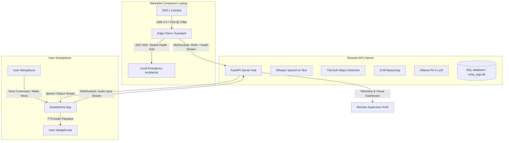

# VICKY Project: Cloud-Assisted Mobile Navigation System
A wearable/companion visual navigation assistant designed to guide visually impaired users through indoor environments.

## 🛠 Hardware Configuration
The project is optimized for a modular, mobile setup restricted to three physical assets:
1. **ZED 1 Stereo Camera**: Captures wide-angle stereoscopic depth and RGB feeds.
2. **NVIDIA GPU Gaming Laptop**: Serves as the companion edge processor (carried in a backpack).
3. **Smartphone**: Connects via a local Wi-Fi LAN loop to serve as the user's audio-vocal interface and transceiver link.

*(Note: Legacy Raspberry Pi, Jetson Orin Nano, and OAK-D camera configurations are deprecated).*

---

## 🚀 System Architecture
The system supports three cross-comparable compute deployment architectures:



### The Three Deployment Modes:
1. **Mode 1 (Local All-in-One)**: Runs YOLOv8, geometry-based ZED SDK depth mapping, and a localized quantized LLM (Ollama Phi-3-mini) entirely on the NVIDIA laptop. Pass audio navigation strings locally to the smartphone over a Wi-Fi LAN loop on port `8005`.
2. **Mode 2 (Distributed Pure Cloud)**: Streams compressed RGB frames and downsampled depth matrices from the Laptop to the FastAPI Server via WebSockets. The server runs YOLOv8 and depth zoning, returning closed-loop navigation commands back to the client.
3. **Mode 3 (Edge-Cloud Hybrid)**: Runs local 15 FPS safety avoidance corridors on the Laptop, while routing high-overhead conversational VLM/LLM queries asynchronously over a cellular/Wi-Fi link to the FastAPI Cloud Server.

---

## 📂 Codebase Directory Structure (`/zed`)
* [server.py](file:///c:/Users/RJS/Documents/세종대/Coding%20Workspace/Capstone%20Design%20AI%20Smart%20Robot/capstone-ai-smart-robot/zed/server.py): Main unified system entrypoint. Boots the ZED camera vision loop in a background thread and exposes FastAPI REST endpoints for client voice commands, live navigation status, and mock maps.
* [zed_depth_processor.py](file:///c:/Users/RJS/Documents/세종대/Coding%20Workspace/Capstone%20Design%20AI%20Smart%20Robot/capstone-ai-smart-robot/zed/zed_depth_processor.py): Interfaces with the ZED SDK. Configured for VGA @ 15fps resolution to accommodate USB 2.0 bandwidth fallback. Calculates Left, Center, and Right obstacle distances.
* [zed_room_guidance.py](file:///c:/Users/RJS/Documents/세종대/Coding%20Workspace/Capstone%20Design%20AI%20Smart%20Robot/capstone-ai-smart-robot/zed/zed_room_guidance.py): Visual room dashboard display displaying depth heatmap streams and dynamic steering vector suggestions.
* [zed_vision_assistant.py](file:///c:/Users/RJS/Documents/세종대/Coding%20Workspace/Capstone%20Design%20AI%20Smart%20Robot/capstone-ai-smart-robot/zed/zed_vision_assistant.py): Master application loop coordinating YOLOv8, EasyOCR, wake word engine (`openwakeword` listening for *"Jarvis"*), Whisper tiny transcriber, local Ollama Phi-3 reasoner, and background WebSocket telemetry feeds.
* [vicky_edge_client.py](file:///c:/Users/RJS/Documents/세종대/Coding%20Workspace/Capstone%20Design%20AI%20Smart%20Robot/capstone-ai-smart-robot/zed/vicky_edge_client.py): Core edge pipe that captures frames and broadcasts text-to-speech commands locally to smartphone app clients.
* [vicky_server.py](file:///c:/Users/RJS/Documents/세종대/Coding%20Workspace/Capstone%20Design%20AI%20Smart%20Robot/capstone-ai-smart-robot/zed/vicky_server.py): FastAPI server hosting the `/ws/telemetry/stream` and `/ws/video/stream` endpoints, server-side YOLO loops, and `/api/infer/vlm`.
* [vicky_db.py](file:///c:/Users/RJS/Documents/세종대/Coding%20Workspace/Capstone%20Design%20AI%20Smart%20Robot/capstone-ai-smart-robot/zed/vicky_db.py): Asynchronous database logging wrapper (SQLAlchemy fallback to SQLite `vicky_logs.db`).
* [vicky_benchmarker.py](file:///c:/Users/RJS/Documents/세종대/Coding%20Workspace/Capstone%20Design%20AI%20Smart%20Robot/capstone-ai-smart-robot/zed/vicky_benchmarker.py): Simulation harness that tests safety reaction time (SRT) under packet loss, RTT delays, and bandwidth constraints.
* [hud.html](file:///c:/Users/RJS/Documents/세종대/Coding%20Workspace/Capstone%20Design%20AI%20Smart%20Robot/capstone-ai-smart-robot/zed/templates/hud.html): HTML5/JavaScript dashboard rendering live video streams, 10m x 10m Bird's Eye View (BEV) obstacle tracks, and latency charts.

---

## ⚡ Quick Start & Execution

### 1. Pre-requisites & Library Setup
Make sure the ZED SDK is installed, then install Python dependencies:
```bash
pip install fastapi uvicorn websockets sqlalchemy aiosqlite ultralytics easyocr pygame edge-tts whisper sounddevice soundfile pyaudio openwakeword python-multipart
```

### 2. Start the Unified Server (Local AI Server)
Runs the unified entrypoint which initiates the ZED camera loop in the background and launches the FastAPI server:
```bash
python zed/server.py
```
* **API Endpoints**:
  * `GET http://127.0.0.1:8000/status`: Polled by client apps for live spatial tracking coordinates, guidance, detections, calculated A* paths, and active navigation goals.
  * `GET http://127.0.0.1:8000/map`: Interactive HSL-themed supervisor HUD canvas dashboard showing live ZED pose (blue marker + yaw), obstacles (red), A* path (green), and goal (golden target). Allows clicking on the grid to change the destination dynamically.
  * `POST http://127.0.0.1:8000/api/set-goal`: Sets the active navigation goal index coordinate `(row, col)` (or clears it if coordinates are empty).
  * `POST http://127.0.0.1:8000/api/reset-map`: Clears the persistent SLAM depth obstacle grid from the processor context thread-safely.
  * `POST http://127.0.0.1:8000/voice-command`: Receives uploaded compressed audio files from the smartphone, runs Whisper STT transcription, and queries LLM reasoning logic.

### 3. Running Simulation / Performance Benchmarking
Simulates system execution cycles to calculate safety reaction times across various modes:
```bash
python zed/vicky_benchmarker.py --trials 200
```