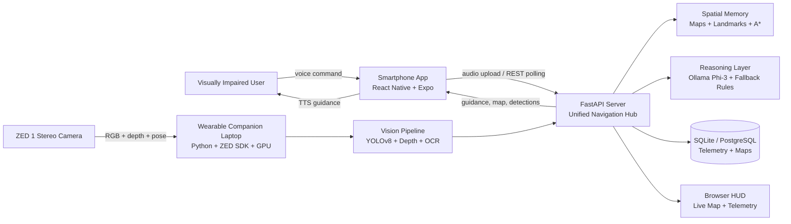
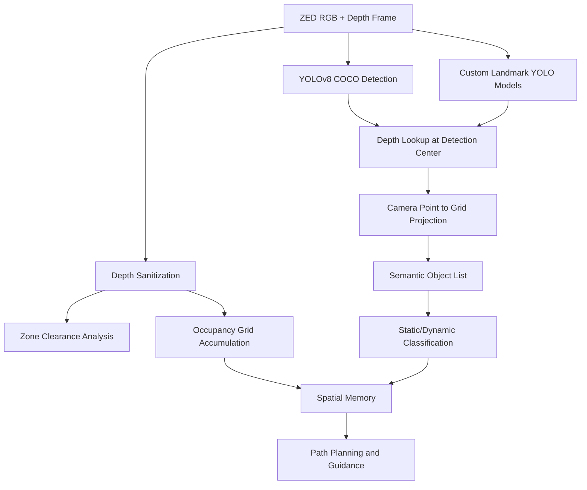
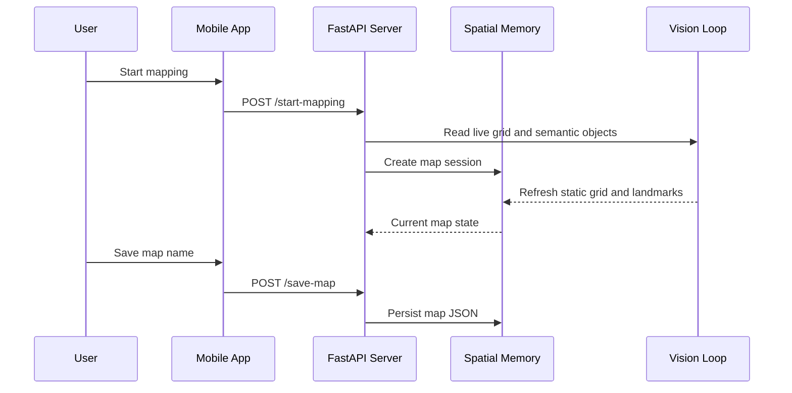
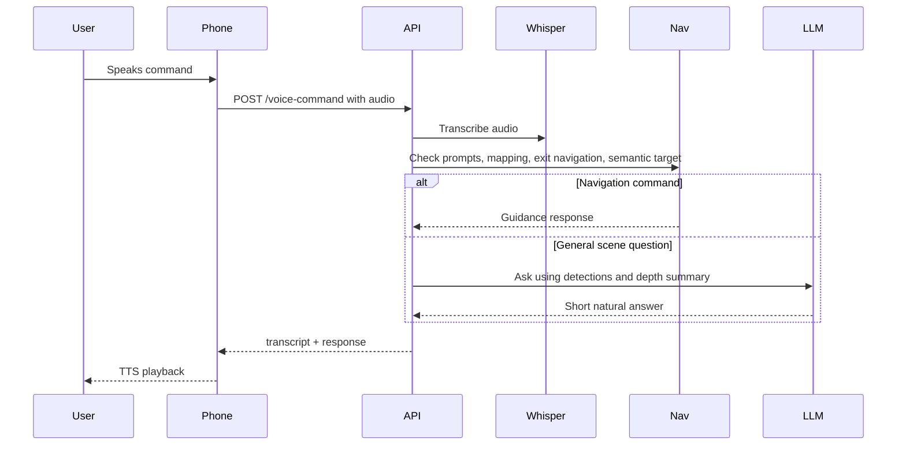

# VICKY System Architecture and Technical Feature Report

## 1. Executive Summary

VICKY is a wearable indoor navigation assistant for visually impaired users. The system combines a ZED 1 stereo camera, a GPU-capable companion laptop, a smartphone interface, and a FastAPI service layer to deliver real-time obstacle awareness, semantic object detection, room mapping, exit navigation, and voice-based guidance.

The current implementation has evolved from the original capstone robot architecture into a wearable companion system. Instead of controlling a rover, VICKY focuses on guiding a human user through indoor space. The architecture therefore prioritizes low-latency local safety decisions, robust spatial mapping, mobile audio interaction, and recoverable navigation prompts.

This report uses the provided capstone report as the reference baseline and updates the description to match the current codebase, including the ZED-based spatial pipeline, React Native companion app, FastAPI server, YOLO landmark detection, semantic navigation, persistent spatial memory, and calibration layers for pose, heading, and object projection.

## 2. System Goals

VICKY is designed around four primary goals:

1. Provide real-time obstacle awareness for a visually impaired user.
2. Detect semantic landmarks such as doors, doorways, exit signs, furniture, and dynamic obstacles.
3. Build and reuse spatial memory of rooms so the system can guide users toward exits and saved landmarks.
4. Support natural voice interaction through speech-to-text, language reasoning, and text-to-speech feedback.

The system is not just an object detector. It fuses RGB detection, stereo depth, VSLAM pose, occupancy grids, semantic object classification, and route planning into a closed-loop navigation assistant.

## 3. High-Level Architecture



## 4. Physical System Architecture

The current VICKY deployment is centered on three main hardware assets:

| Component | Role |
| --- | --- |
| ZED 1 stereo camera | Captures RGB frames, stereo depth, and positional tracking data. |
| NVIDIA GPU laptop | Runs the Python vision pipeline, FastAPI service, YOLO inference, spatial memory, and local reasoning. |
| Smartphone | Provides the user-facing interface, microphone recording, speech playback, map display, and server discovery. |

Legacy Raspberry Pi, ESP32 rover, OAK-D, and mobile robot concepts appear in older archive documentation, but the active implementation is the wearable ZED + laptop + phone architecture.

## 5. Deployment Modes

The project supports three conceptual compute modes from the capstone reference:

| Mode | Name | Description |
| --- | --- | --- |
| Mode 1 | Local all-in-one | Vision, depth processing, mapping, reasoning, and guidance run on the companion laptop. |
| Mode 2 | Distributed cloud | RGB/depth/telemetry can be streamed to a server-side FastAPI pipeline for centralized processing. |
| Mode 3 | Edge-cloud hybrid | Immediate safety and depth guidance run locally, while higher-latency reasoning or VLM-style tasks can be routed remotely. |

The active `zed/server.py` entrypoint mainly behaves as a local or edge-hybrid server. It can run the local ZED camera loop or operate in edge telemetry mode via `--no-camera`.

## 6. Software Stack

### Backend and Vision

| Layer | Technologies |
| --- | --- |
| API service | FastAPI, Uvicorn, WebSockets |
| Vision | ZED SDK, OpenCV, NumPy |
| Object detection | Ultralytics YOLOv8 |
| Landmark detection | Custom YOLO weights for exit signs and doors |
| OCR | EasyOCR, optional runtime path |
| Speech-to-text | OpenAI Whisper local package |
| Wake word and voice loop | openwakeword, PyAudio, sounddevice, soundfile |
| Text-to-speech | edge-tts, pygame playback |
| LLM reasoning | Ollama Phi-3 when available, rule-based fallback otherwise |
| Semantic matching | sentence-transformers `all-MiniLM-L6-v2`, scikit-learn cosine similarity |
| Database | SQLAlchemy async, SQLite fallback, PostgreSQL via Docker Compose |
| Containerization | Dockerfile.server, docker-compose.yml |

### Mobile App

| Layer | Technologies |
| --- | --- |
| Runtime | Expo, React Native |
| Audio | expo-av, expo-speech |
| Sensors | expo-sensors, expo-network |
| Visualization | react-native-svg, react-native-webview |
| UI | React Native components and custom spatial map rendering |

## 7. Major Code Modules

| File | Responsibility |
| --- | --- |
| `zed/server.py` | Unified FastAPI entrypoint, status API, voice command API, mapping API, navigation API, browser HUD, WebSocket telemetry ingestion. |
| `zed/zed_vision_assistant.py` | Main local vision loop for ZED RGB/depth, YOLO detection, landmark detection, OCR, speech loop, TTS, telemetry publishing. |
| `zed/zed_depth_processor.py` | ZED SDK integration, depth sanitization, left/center/right clearance estimation, occupancy grid accumulation, safe direction logic. |
| `zed/spatial_memory.py` | Persistent room maps, landmark extraction, static/dynamic object separation, map graph, A* path planning, exit routing, guidance generation. |
| `zed/semantic_navigation.py` | Semantic target matching between voice commands and visible detections using MiniLM embeddings and cosine similarity. |
| `zed/llm_reasoner.py` | Short natural-language guidance using Ollama Phi-3 when available, with deterministic fallback responses. |
| `zed/map_coordinates.py` | Shared coordinate system, pose-to-grid conversion, camera point projection, yaw normalization, display/projection calibration. |
| `zed/vicky_db.py` | Async SQLAlchemy logging for spatial telemetry and occupancy maps. |
| `zed/vicky_edge_client.py` | Edge/simulation client supporting compute-mode experiments and telemetry streaming. |
| `zed/vicky_benchmarker.py` | Simulation harness for safety reaction time, latency, packet loss, depth error, and hallucination metrics. |
| `app54/App.js` | Smartphone app UI, server discovery, voice recording, TTS playback, live map, saved map controls, exit navigation controls. |

## 8. Perception Pipeline

The perception system fuses three streams:

1. RGB frames from the ZED camera.
2. Depth frames from stereo reconstruction.
3. Pose information from ZED positional tracking or telemetry.

The primary loop is:



### YOLO Detection

The system uses a standard COCO model for everyday obstacles and custom landmark models for exit and doorway detection.

Active model categories include:

| Model Type | Example Assets | Purpose |
| --- | --- | --- |
| COCO safety model | `yolov8n.pt`, `yolov8m.pt`, `zed/yolov8m.pt` | Common objects such as people, chairs, tables, bags, laptops, bottles, and furniture. |
| Exit sign detector | `runs/detect/exit_sign_only_v2/weights/best.pt` | Detect emergency exit signs in indoor scenes. |
| Door / doorway detector | `runs/detect/door_combined_v1/weights/best.pt`, door-local datasets | Detect doors and passable doorway openings. |

### Door and Exit Logic

Door detections are not treated as simple labels. The system checks:

- bounding-box geometry for door-like shape,
- depth structure inside the box,
- whether the center path is passable,
- whether a detected door should be classified as a closed `door` or open `doorway`,
- whether an exit sign should become a static landmark.

This allows navigation to reason differently about closed barriers and passable openings.

## 9. Depth and Safety System

`ZedDepthProcessor` converts raw depth into navigation-safe structures.

Core techniques include:

- invalid depth filtering for NaN, Inf, and zero values,
- depth clipping between configurable min/max distances,
- grid downsampling through median aggregation,
- left, center, and right zone clearance analysis,
- open-space ratio estimation,
- deterministic escape-vector generation,
- occupancy confidence maps for free and wall cells,
- ray-clearing between user and observed obstacle cells,
- configurable obstacle-map updates for performance control.

The depth processor produces safety fields such as:

| Output | Meaning |
| --- | --- |
| `left_clearance_mm` | Estimated clearance on the user's left. |
| `center_clearance_mm` | Estimated clearance in the forward corridor. |
| `right_clearance_mm` | Estimated clearance on the user's right. |
| `escape_vector` | Deterministic command such as `STOP`, `GO FORWARD`, or turn guidance. |
| `occupancy_grid` | 100x100 grid representing free, occupied, or unknown cells. |

## 10. Coordinate System and Projection

The system uses a 100x100 bird's-eye grid where the user starts near the center. `map_coordinates.py` centralizes the conversion logic:

| Function | Purpose |
| --- | --- |
| `pose_mm_to_grid()` | Converts ZED pose translation into grid coordinates. |
| `image_x_to_camera_point()` | Converts image x-position and depth into local camera coordinates. |
| `camera_point_to_grid()` | Projects camera-space object points into world/grid space using projection yaw. |
| `forward_grid_cell()` | Finds the cell in front of the user for wall-ahead checks. |
| `bearing_to_grid_delta()` | Converts grid delta into bearing for route guidance. |

The current architecture deliberately separates:

| Yaw Field | Purpose |
| --- | --- |
| `display_yaw` | Draws the user icon heading in the mobile app and browser HUD. |
| `projection_yaw` | Projects detected objects and depth points onto the map. |
| `yaw` | Backend-compatible navigation yaw, currently aligned with projection yaw. |

This split prevents UI-facing fixes from accidentally corrupting object projection or movement mapping. Runtime calibration knobs include:

```bash
VICKY_ZED_X_SIGN
VICKY_ZED_Z_SIGN
VICKY_ZED_YAW_SIGN
VICKY_ZED_HEADING_OFFSET_DEG
VICKY_DISPLAY_YAW_SIGN
VICKY_DISPLAY_YAW_OFFSET_DEG
VICKY_PROJECTION_YAW_SIGN
VICKY_PROJECTION_YAW_OFFSET_DEG
VICKY_CAMERA_X_SIGN
```

## 11. Spatial Memory and Mapping

The spatial memory subsystem turns live detection into persistent room knowledge.

### Map Representation

Each saved map stores:

- `map_id` and `map_name`,
- `static_grid`,
- `cell_type_grid`,
- `landmarks`,
- `static_objects`,
- grid counts and coverage metadata,
- origin pose/grid information,
- doorway and exit graph links.

Cell types include:

| Value | Label |
| --- | --- |
| 0 | free |
| 1 | wall |
| 2 | unknown |
| 3 | static object |
| 4 | dynamic object |
| 5 | doorway |
| 6 | unknown obstacle |

### Mapping Workflow



### Static vs Dynamic Handling

Static objects are used for room structure and saved landmarks. Dynamic objects are overlaid live during navigation so they can block a path without permanently corrupting the room map.

Examples:

| Static / Landmark | Dynamic |
| --- | --- |
| door, doorway, exit sign, table, bench, bed, TV, shelf | person, bottle, backpack, handbag, suitcase, laptop, phone, book |

## 12. Navigation and Path Planning

VICKY uses A* path planning on the occupancy grid. The path planner considers:

- static walls and obstacles,
- dynamic live obstacles,
- unknown cells,
- path length,
- proximity to moving objects,
- doorway and exit landmarks,
- whether the user is drifting away from the path,
- whether the next route segment is blocked.

Important navigation features:

| Feature | Description |
| --- | --- |
| Exit selection | Chooses the safest reachable door, doorway, or exit sign. |
| Reachable goal search | Searches around blocked target cells for reachable nearby cells. |
| Rerouting | Recalculates paths when live obstacles block the route. |
| Path deviation detection | Warns when the user drifts away from the route. |
| Wrong-direction detection | Detects when the user moves away from the goal. |
| Doorway transition prompt | Asks whether the user entered a new room and can start a new map. |
| Map graph linking | Links room maps through doorway IDs. |

## 13. Voice and Language Pipeline

VICKY supports both mobile-uploaded voice commands and local voice-loop operation.

### Mobile Voice Flow



### Reasoning Layer

`llm_reasoner.py` first attempts Ollama Phi-3. If Ollama is unavailable or errors, it falls back to deterministic rules based on:

- detected object labels,
- object position,
- object depth,
- left/center/right clearances,
- current guidance vector,
- OCR text when available.

This fallback is important for assistive safety because the system can still answer basic spatial questions without a generative model.

## 14. Semantic Navigation

`semantic_navigation.py` uses `SentenceTransformer("all-MiniLM-L6-v2")` to match natural commands to detected object classes.

Example semantic matches:

| User Command | Possible Detection |
| --- | --- |
| "take me somewhere to sit" | chair, bench, couch |
| "find the door" | door, doorway |
| "guide me to the exit" | exit sign, doorway |

The module tracks active targets and gives simple guidance:

- turn left,
- turn right,
- move forward,
- stop when close,
- scan left/right if the target is lost,
- ask whether to switch to a closer alternative.

## 15. Mobile Application Features

The React Native app in `app54/App.js` acts as the user-facing interface.

Key capabilities:

| Feature | Description |
| --- | --- |
| Server discovery | Scans likely LAN addresses and probes the FastAPI root endpoint. |
| Voice recording | Uses `expo-av` to record audio commands. |
| Voice playback | Uses `expo-speech` for spoken responses. |
| Autopilot polling | Calls `/autopilot-guidance` for active guidance and prompts. |
| Status polling | Calls `/status` and `/pose` for map, object, and pose updates. |
| Spatial map UI | Renders occupancy cells, landmarks, path, user icon, heading, static objects, and live dynamic objects. |
| Saved map controls | Start mapping, save, load, unload, and find exit. |
| Web HUD embedding | Embeds `/map?embed=true` through `react-native-webview`. |
| Prompt answer UI | Supports yes/no responses for mapping and room-transition prompts. |

## 16. Browser HUD

The FastAPI server exposes `/map`, an HTML canvas dashboard for debugging and supervision.

It displays:

- 100x100 occupancy grid,
- A* route path,
- destination goal,
- semantic object markers,
- user pose and heading,
- depth clearances,
- current guidance command,
- detected object list,
- reset and goal controls.

The HUD can run standalone in a browser or embedded in the mobile app with `?embed=true`.

## 17. API Surface

### Live Status and Guidance

| Method | Endpoint | Purpose |
| --- | --- | --- |
| GET | `/` | Health/status and local URLs. |
| GET | `/status` | Full live map, pose, detections, navigation state, path, and spatial memory summary. |
| GET | `/pose` | Pose and grid location only. |
| GET | `/autopilot-guidance` | Current active guidance or prompt payload. |
| GET | `/navigation-guidance` | Spatial memory navigation guidance. |
| GET | `/map` | Browser HUD. |

### Voice and Text Commands

| Method | Endpoint | Purpose |
| --- | --- | --- |
| POST | `/voice-command` | Upload audio, transcribe with Whisper, execute navigation or scene query. |
| POST | `/command` | Text command equivalent of voice command. |
| POST | `/api/transcribe` | Transcribe an uploaded audio file only. |
| POST | `/answer-prompt` | Answer mapping or doorway yes/no prompts. |

### Mapping and Navigation

| Method | Endpoint | Purpose |
| --- | --- | --- |
| POST | `/start-mapping` | Start a room mapping session. |
| POST | `/save-map` | Save current map with optional name. |
| POST | `/stop-mapping` | Stop mapping mode. |
| GET | `/maps` | List saved maps and map graph. |
| POST | `/load-map` | Load map by ID or name. |
| POST | `/unload-map` | Unload current map. |
| GET | `/current-map` | Return active map metadata and map data. |
| POST | `/start-navigation` | Start navigation to an exit or landmark. |
| POST | `/stop-navigation` | Stop navigation. |
| POST | `/link-map-door` | Link two room maps through doorway IDs. |

### Low-Level Map and Telemetry

| Method | Endpoint | Purpose |
| --- | --- | --- |
| POST | `/api/set-goal` | Set or clear manual A* goal coordinate. |
| POST | `/api/reset-map` | Reset occupancy grid. |
| POST | `/api/map` | Store occupancy map snapshot in the database. |
| GET | `/api/map` | Retrieve latest stored occupancy map for a session. |
| WS | `/ws/telemetry/stream` | Receive pose, depth zones, and semantic objects from an edge client. |
| WS | `/ws/video/stream` | Consume video bytes from edge client. |

## 18. Data Storage

VICKY uses two persistence paths:

1. SQL telemetry storage through `vicky_db.py`.
2. JSON room maps through `zed/maps`.

### SQL Tables

| Table | Purpose |
| --- | --- |
| `vicky_spatial_logs` | Frame-level telemetry, pose, clearance, semantic objects, latency, network metrics, phone IMU. |
| `vicky_occupancy_maps` | Session map snapshots with pose and grid data. |

The database defaults to SQLite (`vicky_logs.db`) but Docker Compose provisions PostgreSQL and sets `DATABASE_URL` for server deployments.

### JSON Spatial Memory

Saved room maps are written under `zed/maps`, with `map_graph.json` storing links between maps and doorways.

## 19. Performance and Benchmarking

`zed/vicky_benchmarker.py` simulates benchmark trials for:

- safety reaction time,
- YOLO latency,
- LLM/VLM reasoning latency,
- network delay,
- packet loss,
- depth error,
- timeout count,
- missing target count,
- hallucination count,
- overall success rate.

The benchmark harness supports:

```bash
python zed/vicky_benchmarker.py --trials 200 --rtt 30 --loss 0.02 --bandwidth 25 --perception A --mode 3
```

The benchmark separates deterministic YOLO + depth perception (`perception A`) from a more generative VLM-style paradigm (`perception B`), reflecting the capstone report's comparison between fast local safety and richer but slower reasoning.

## 20. Safety Design

The system uses multiple safety layers:

| Layer | Safety Function |
| --- | --- |
| Depth clearance | Immediate left/center/right clearance estimation. |
| Escape vector | Deterministic stop/turn/forward command independent of LLM output. |
| Dynamic obstacle overlay | Live people and movable objects can block route planning without modifying saved maps. |
| LLM fallback | If Ollama fails, deterministic responses still describe obstacles and safe direction. |
| Prompt gating | Mapping and new-room transitions require user confirmation. |
| Path tracking | Warnings for drift, wrong direction, blocked path, and walls ahead. |
| Local-first operation | Critical spatial processing can run on the laptop without relying on network latency. |

## 21. Technical Features Inventory

### Computer Vision

- ZED stereo RGB/depth capture.
- ZED positional tracking.
- OpenCV frame handling and HUD rendering.
- YOLOv8 COCO obstacle detection.
- Custom YOLO landmark detection.
- Exit sign validation through visual color/shape checks.
- Optional EasyOCR text extraction.
- Door passability classification through geometry and depth.
- Detection stability tracking through IoU and observation duration.

### Spatial Intelligence

- 100x100 occupancy grid.
- Free/wall/unknown confidence accumulation.
- Cell-type semantic map.
- Static object extraction.
- Dynamic obstacle overlay.
- Room map persistence.
- Room-to-room graph linking.
- A* pathfinding.
- Landmark scoring.
- Exit route selection.
- Re-routing and path deviation detection.

### Interaction

- Smartphone voice recording.
- Whisper transcription.
- Text command endpoint.
- Natural guidance responses.
- Expo speech playback.
- Yes/no prompt resolution.
- Mobile and browser map display.
- Embedded WebView support.

### Systems Engineering

- FastAPI REST and WebSocket APIs.
- Background auto-mapping thread.
- Async SQLAlchemy logging.
- SQLite local fallback and PostgreSQL deployment path.
- Dockerized server option.
- Edge client simulation mode.
- Runtime calibration through environment variables.

## 22. Known Constraints and Engineering Notes

The current system is optimized for indoor navigation and capstone-scale demonstration. Important constraints include:

- ZED 1 USB 2.0 operation is configured conservatively at VGA / 15 FPS for reliability.
- Long-range or textureless surfaces can produce invalid stereo depth and require filtering.
- YOLO object projection depends on accurate camera-depth alignment and yaw calibration.
- Exit and door models are environment-sensitive and benefit from locally captured training data.
- Generative reasoning is intentionally bounded by short answers and fallback rules for safety.
- The mobile app depends on local network reachability to the FastAPI server.

## 23. Suggested Future Extensions

Potential next steps:

1. Add an explicit calibration screen for facing, object projection, and camera mirroring.
2. Add automated projection tests using known object positions in a calibration room.
3. Add route replay and map quality scoring.
4. Add user-centered audio design for obstacle urgency and confidence levels.
5. Add cloud/offline mode switching in the mobile app.
6. Add formal evaluation metrics from user trials: completion time, wrong-turn count, safety stop count, and subjective workload.

## 24. Conclusion

VICKY is a multimodal assistive navigation system that combines stereo depth, semantic object detection, spatial memory, path planning, and voice interaction. Its architecture is intentionally hybrid: deterministic depth and navigation logic protect the user in real time, while semantic models and language reasoning provide richer context and natural guidance.

Compared with the original capstone robot framing, the current implementation is more directly centered on visually impaired human navigation. The main technical contribution is the integration of live perception, persistent room memory, landmark-aware A* navigation, and mobile voice interaction into a single wearable guidance loop.
